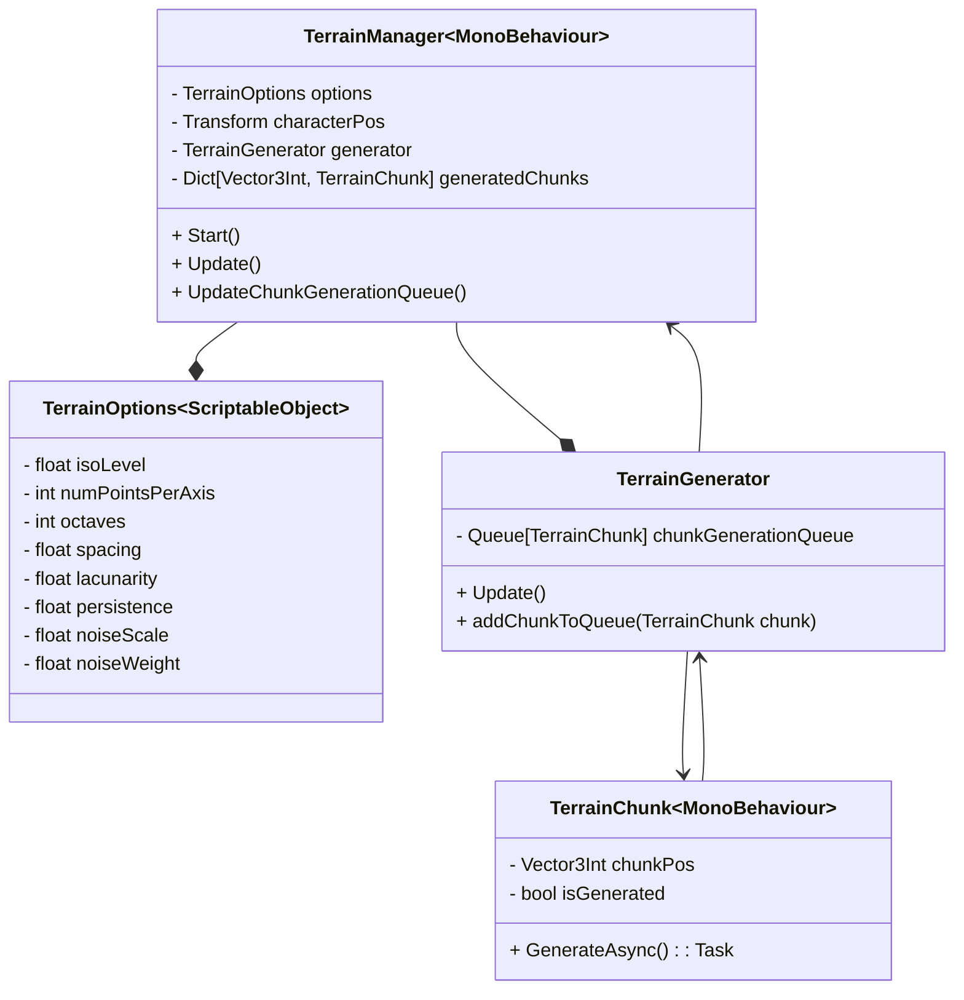

```mermaid
classDiagram

class TerrainOptions ~ScriptableObject~{
    - float isoLevel
    - int numPointsPerAxis
    - int octaves
    - float spacing
    - float lacunarity
    - float persistence
    - float noiseScale
    - float noiseWeight
}

class TerrainManager~MonoBehaviour~{
    - TerrainOptions options
    - Transform characterPos
    - TerrainGenerator generator
    - Dict[Vector3Int, TerrainChunk] generatedChunks
    + Start()
    + Update()
    + UpdateChunkGenerationQueue()
}

class TerrainGenerator {
  - Queue[TerrainChunk] chunkGenerationQueue
  + Update()
  + addChunkToQueue(TerrainChunk chunk)
}

class TerrainChunk ~MonoBehaviour~{
  - Vector3Int chunkPos
  - bool isGenerated
  + GenerateAsync(): Task
}

TerrainManager --* TerrainGenerator
TerrainManager --* TerrainOptions
TerrainGenerator --> TerrainChunk
TerrainGenerator --> TerrainManager
TerrainChunk --> TerrainGenerator
```